# JobTracker

JobTracker is a modern Full-Stack Job Portal Application built using React.js, Node.js, Express.js, and MongoDB. The platform connects recruiters and job seekers in a seamless way. Recruiters can create and manage job postings, review applicants, and update application statuses, while candidates can browse jobs, apply for positions, and track their applications.

The project follows a modern MERN Stack architecture and uses the latest frontend technologies to deliver a responsive, scalable, and user-friendly experience.

## Frontend Technologies

### React 19

React is used for building reusable and interactive user interface components. It enables fast rendering and efficient state management.

### React Router DOM

Used for client-side routing, allowing users to navigate between pages without refreshing the browser

### React Hook Form

Provides efficient form handling and validation with minimal re-renders, improving application performance.

### Axios

Used for making HTTP requests between the frontend and backend APIs.

### Tailwind CSS v4

A utility-first CSS framework used to create responsive and modern user interfaces quickly.

### Lucide React

A modern icon library used throughout the application for professional-looking icons.

### React Hot Toast

Used to display user-friendly success, error, and notification messages.

## Authentication & Security

JobTracker implements a secure authentication and authorization system using JWT (JSON Web Tokens). Both Recruiters and Candidates have separate authentication flows and protected dashboards.

### User Authentication

1. User Registration (Candidate & Recruiter)
2. Secure Login System
3. JWT-based Authentication
4. Persistent Login using Local Storage
5. Secure Logout Functionality
6. Automatic Token Validation
7. Unauthorized Access Prevention

### Route Protection

The application uses custom Protected Route Guards to ensure users can only access pages that belong to their role.

### Candidate Route Guard

1. Only authenticated candidates can access candidate pages.
2. Recruiters cannot access candidate routes.
3. Unauthenticated users are automatically redirected to the login page.

### Recruiter Route Guard

* Only authenticated recruiters can access recruiter dashboard routes.
* Candidates cannot access recruiter routes.
* Direct URL access to protected pages is restricted.

### API Security

All protected API requests are handled using Axios with JWT Authorization headers.

**Example Flow:**

1. User logs in successfully.
2. Backend generates a JWT token.
3. Token is stored in Local Storage.
4. Every protected API request sends the token in the Authorization header.
5. Backend verifies the token before providing access to resources.

This ensures that only authenticated users can access sensitive data and actions.

### Role-Based Architecture

The application is divided into two independent user roles:

### Candidate Module

#### Candidates can :-

 Create an account
 Login securely
 Browse available job opportunities
 View detailed job descriptions
 Apply for jobs
 Track application status
 View previously applied jobs
 Logout securely

### Recruiter Module

#### Recruiters can

  Create recruiter accounts
  Login securely
  Access recruiter dashboard
  Create job postings
  Manage posted jobs
  View all applicants
  Review candidate profiles
  Update application status
  Logout securely

### Navigation System

The platform provides separate navigation systems for each user role.

### Candidate Navigation

 -> Home
 -> Job Listings
 -> Applied Jobs
 -> Logout

### Recruiter Navigation

 -> Dashboard
 -> Post Job
 -> Job Listings
 -> Applicants
 -> Profile
 -> Logout
This separation ensures a clean and role-specific user experience.

## Application Workflow

### Candidate Workflow

1. Register Account
2. Login
3. Browse Jobs
4. View Job Details
5. Apply for Jobs
6. Track Application Status

### Recruiter Workflow

1. Register Account
2. Login
3. Access Dashboard
4. Create Job Posts
5. Manage Job Listings
6. View Applicants
7. Update Candidate Status

## Additional Features

1. Responsive Design for Mobile and Desktop
2. Form Validation using React Hook Form
3. Real-Time Toast Notifications
4. Dynamic Routing with React Router
5. Secure REST API Communication using Axios
6. Context API State Management
7. MongoDB Database Integration
8. Professional Recruiter Dashboard
9. Candidate Application Tracking System

## photos

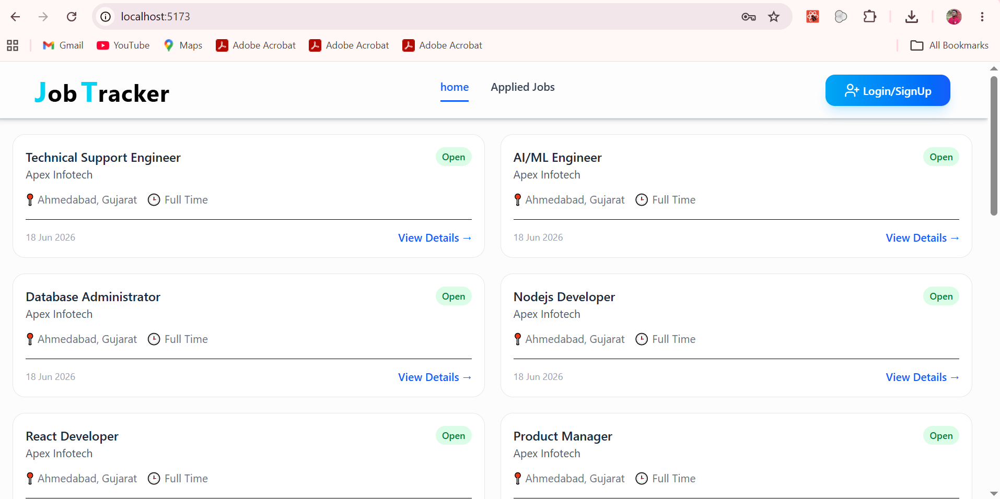
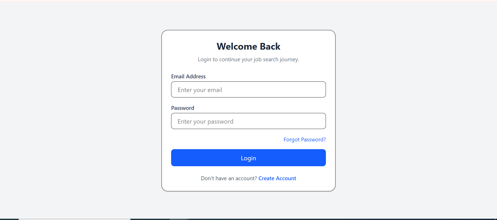
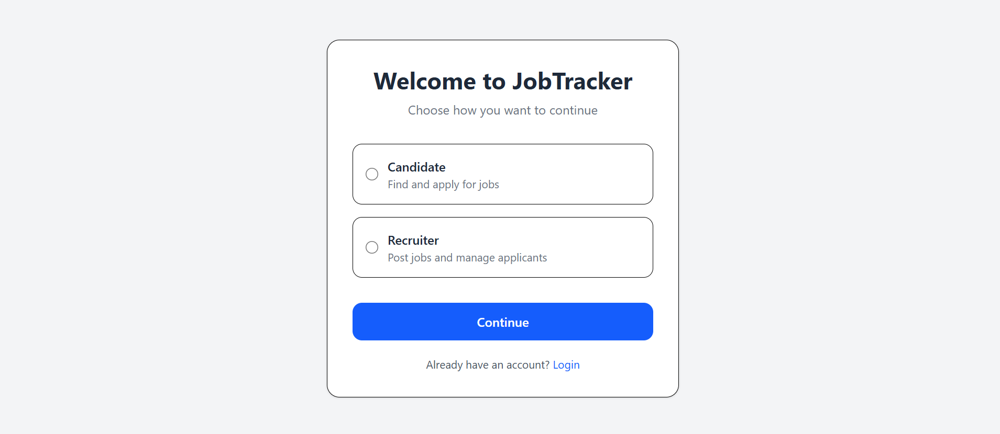
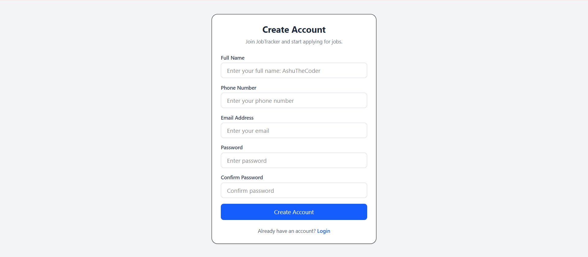
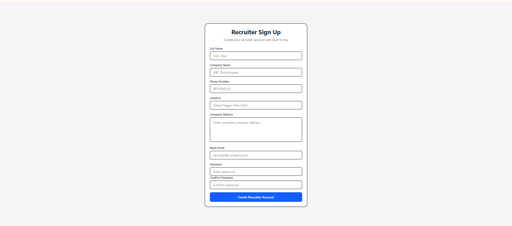
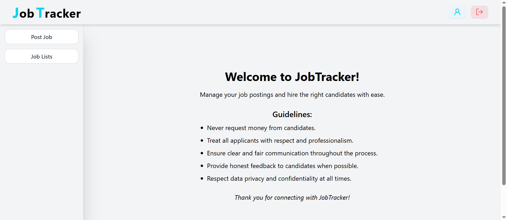
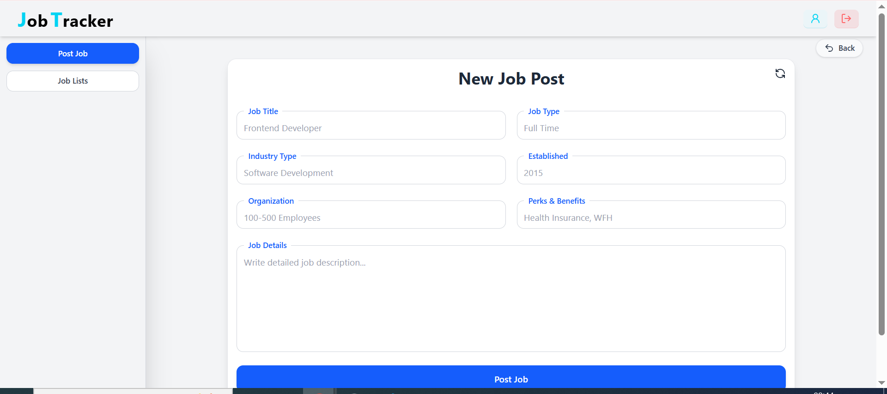
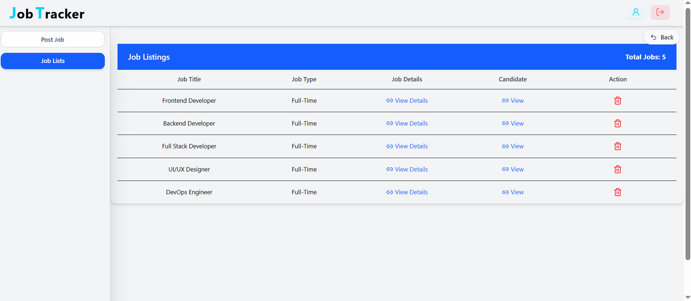
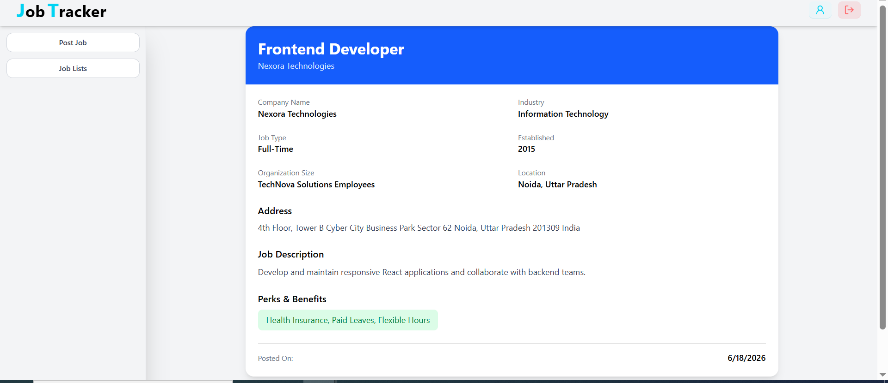
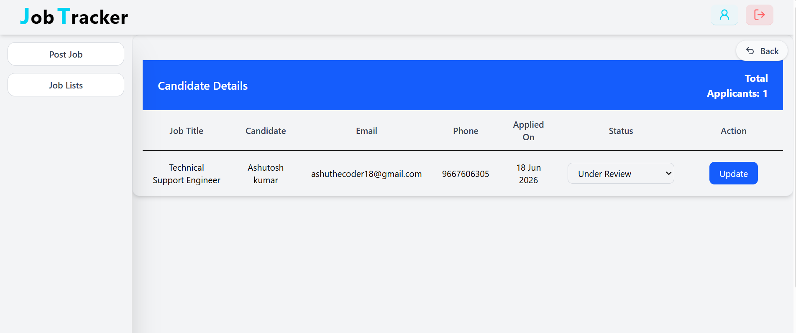
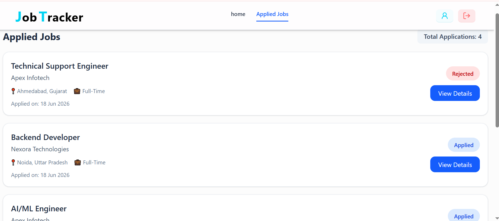
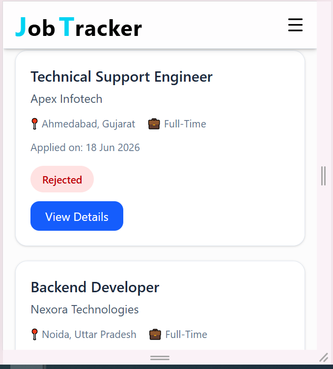
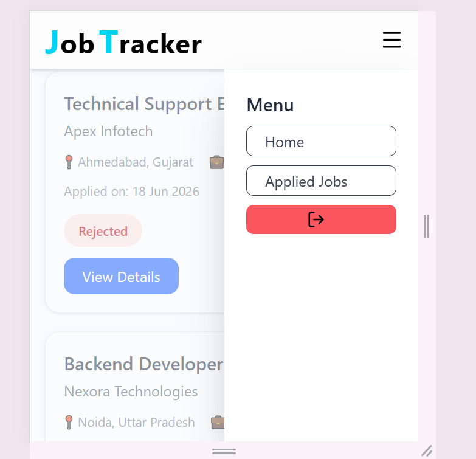

## Ashutosh Kumar
